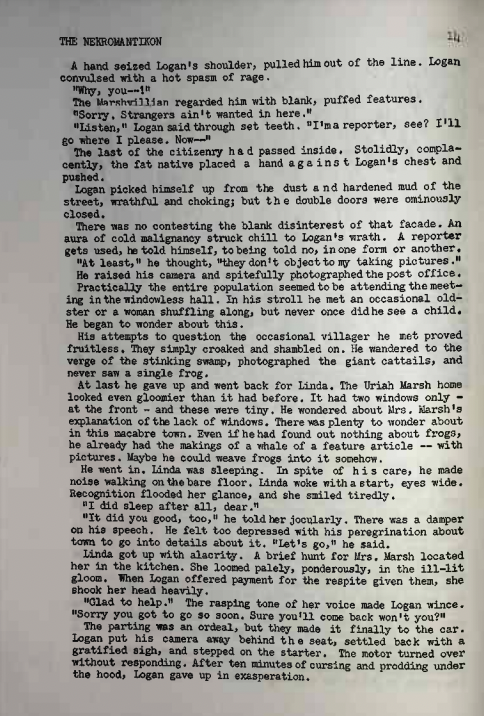
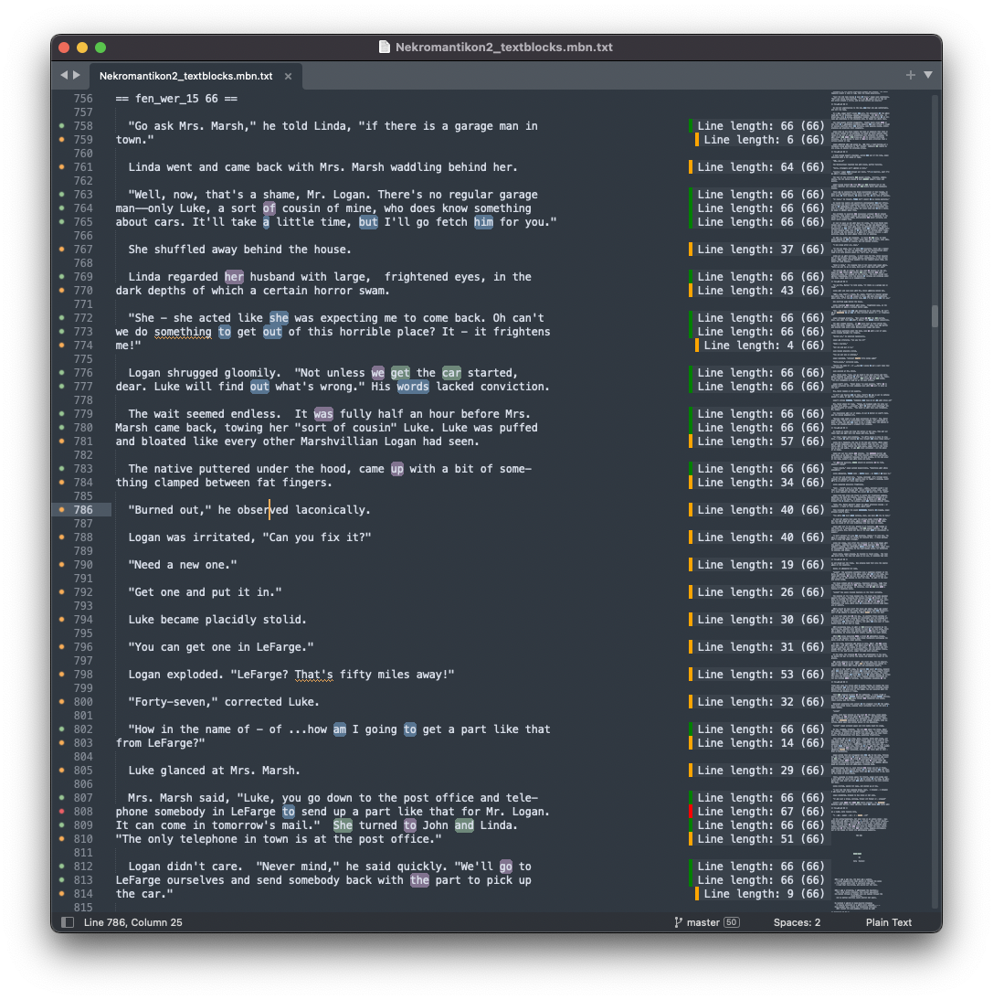

# Sublime Text Banister plugin

## The General Problem

In my adventures, I somehow often find myself in situations where I want to add markup to a text file but without actually CHANGING the text file. Markup is wonderful, but as a file becomes marked up, one loses one's ability to actually edit the CONTENT of text file - it can be hard to gauge how a paragraph actually "reads" when there is a bunch of markup in the way.

This Sublime Text plugin approaches the problem by allowing passages of a text file to be highlighted and tagged in Sublime Text, and then that metadata saved to a separate "sidecar" file, either for reopening back into Sublime Text (to allow further revisions) or for later processing using a separate script.

I am going to proceed to discuss the specific problem I'm trying to solve with this plugin, but want to first mention that this approach can probably be useful in other text file editing domains as well. For instance, a similar plugin could be made to apply more general HTML markup to a text document.

## The Specific Problem

As I mentioned, the above is a general workflow problem I have encountered with editing text files. However, the specific use case that actually prompted me to build this plugin is fairly ridiculous and likely won't be that useful to you. Sorry in advance.

This specific script is meant to be used to replicate the formatting that I found in Manly Banister's 1950 Science Fiction fanzine [Nekromantikon](https://fanac.org/fanzines/Nekromantikon/) (shortened colloquially to Nek in this document). Basically, Nek was a magazine that was printed out in one guy's garage using a variety of old-timey printing technologies (mimeograph, lino-printing, photoengraving on zinc plates) in 1950 and 1951. There are a lot of things about Nek that are interesting to me, but one that I kept thinking about when I first saw it was that it had a fully justified layout that was *fully executed on a typewriter*. I became more intrigued when I noticed that some of the spacing in Banister's lines were not evenly monospaced like you'd see on a normal typewriter - Banister was actually using combinations of spaces and half spaces to pad his characters.

Half-spacing was apparently a feature found on some typewriters for enabling certain types of error corrections in typed documents - I'm not sure how frequently it was used for actual formatting purposes.

Now, the most common response that I get when I bring up Banister's formatting of Nek is usually along the lines of "...yeah, so?" But due to some deep-seated personal character flaws, I started to become very interested in how Banister would have executed this, and trying to find a software approach for replicating it. 

Here is the algorithm that would have been required to make this happen:

    1. Count the characters on each line. Most lines in Nekromantikon 2 are 66 characters long.
    2. Where a line is a few characters LONGER than 66 characters:
        a. substitute some of the double spaces in the line (double spaces frequently used to start sentences) with normal spaces, or
        b. substitute spaces before and after a word with half-spaces ('short' spaces).
    3. Where a line is a few characters SHORTER than 66 characters:
        a. substitute a space in the line with a double space, or
        b. substitute spaces before and after a word with 1.5-space width ('stretch') spaces, or
        c. explode a word by adding half-spaces between each letter (exploded word must have an odd number of letters.)

Note that Banister's padding changes involving half-spaces always need to be balanced - half-spaces need to be added to a line in multiples of 2. Banister accomplishes this by always applying padding changes both before and after a single word OR by adding half-spaces in between the letters of a word that has an odd number of characters.

I don't know what criteria Banister was using to decide which specific spacing technique he would use for each particular line. I assume that he was basing the decision was based on mostly on aesthetic determination, but I'm not sure.

## The Plugin

### Actual Markup Used

#### Block Dividers

Example: 

    == fen_wer_15 66 ==

The above markup indicates that the following section should be identified using an id of `fen_wer_15` (which literally maps to the identified page 15 of the printed Nek) in the rendered HTML markup. This is useful for placing the rendered text block in the context of a larger document. The second argument identifies the target line character count for the text blocks that follow.

#### Paragraphs

Paragraphs are delimited by a single blank line in the source text file.

### Commands

Commands can generally be run either from the 'Banister' Menu on the applications menu bar or from the context menu available from right clicking in the editor window.

#### Add/Remove Short Border

Flags the current selection as being surrounded by half spaces - flag is displayed as a blue highlight. 

#### Add/Remove Stretch Border

Flags the current selection as being surrounded by 1.5-width spaces - flag is displayed as a purple highlight.

#### Explode/Unexplode Word

Flags the current selection as containing half spaces between each character of the word. Should only be used on words with an odd number of characters to retain a balanced number of characters. Flag is displayed as a green highlight.

#### Add/Remove Underline Region

Flags the current selection as being underlined. Flag is displayed as a wavy underline.

#### Reset Regions for Selected

Removes all Banister regions that contain the current character position (useful for undoing formatting mistakenly applied multiple formats).

#### Import MBN Regions

Manually load an MBN sidecar file for current file and apply overlay to current document. This is normally run automatically when a text file that has an available sidecar file is loader into Sublime Text.

#### Export MBN Regions

Manually save an MBN sidecar file for current file and apply overlay to current document. This is normally run automtaically when a text file that has an available sidecar file is saved from Sublime Text.

#### Count Justified Line Lengths (Application menu only)

Runs through each line of text file in Sublime Text and displays the character count of each line with formatting overlay applied. Lines of the correct length are decorated with green highlights, lines that are long are decorated with red highlights, and lines that are short are decorated with orange highlights.

Note that short lines will be fairly common in practice because the last line of paragraphs as well as paragraphs that cover only a single line are not justified. Long lines are more rare in Banister's output (as they imply that somebody made a mistake in applying the algorithm), but in some cases he does exceed his planned line character count (note the line starting "phone somebody in Lefarge..." (line 808 in the Sublime Text screenshot) for an example of this) in the actual Nek.

#### Render HTML Output (Application menu only)

Exports an HTML version of the current document with fully rendered document markup applied. This is the "final" output of the Banister markup process.

## Known Issues

### Slow region iterations

The approach I used for iterating through regions is very unoptimized (which is most obvious when rendering a full document to HTML). There is probably more that can be done to constrain the regions (perhaps constraining regions to those on a particular line) before iterating through them.