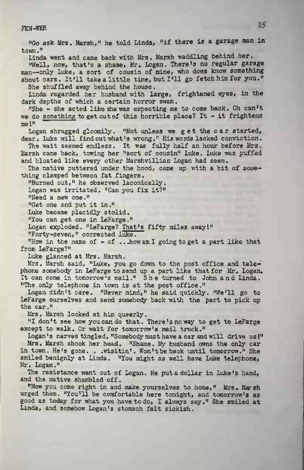

# SublimeText Banister plugin

## The General Problem

In my adventures, I somehow often find myself in situations where I want to add markup to a text file but, without actually CHANGING the text file. As we all know, markup, like HTML or whatever, is cool because it adds a metadata overlay to a text file that can than be "hooked" into using a web browser or css presentation or some such post-processer to add either formatting or functionality.

This is all wonderful, but as a file becomes marked up, one loses their ability to actually edit the CONTENT of text file - it's hard to gauge how a paragraph actually "reads" when there is a bunch of content in the way.

This SublimeText plugin approaches the problem by allowing passages of a text file to be highlighted and tagged in SublimeText, and then that metadata saved to a separate "sidecar" file, either for reopening back into SublimeText (to allow further revisions) or for later processing using a separate script.

## The Specific Problem

As I mentioned, the above is a general workflow problem I have encountered with editing text files. Hoever, the specific use case that actually prompted me to build this plugin is much more specific and likely won't be that universally applicable.

Basically, this specific script is meant to be used to replicate the formatting that I found in Manly Banister's 1950 Science Fiction fanzine [Nekromantikon](Nekromantikonhttps://fanac.org/fanzines/Nekromantikon/). Basically, Nekromantikon was a magazine that was printed out in one guy's garage using a variety of old-timey printing technologies (mimeograph, lino-printing, photoengraving on zinc plates). There are a lot of things about Nekromantikon that are interesting to me, but one that I kept thinking about when I first saw it was that it had a fully justified layout that was *fully executed on a typewriter*. I became more intrigued when I noticed that some of the spacing in Banister's lines were not evenly monospaced like you'd see on a normal typewriter - Banister was actually using combinations of spaces and half spaces to pad his characters.

Now, the most common response that people have when I bring this up is usually along the lines of "...yeah, so?". But due to my own personal limitations, I started to become very interested in how Banister would have executed this. 

This all seems like an absurdly complicated process to undertake manually. Nekromantikon had a page count of 60-90 pages.

Here is the algorithm that would have been required to make this happen.

    1. Count the characters on each line. Most lines in Nekromantikon 2 are exactly 66 characters long.

    2. Where a line is a few characters longer than 66 characters, substitute some of the double spaces in the line with normal spaces OR some of the spaces with half-spaces.

    3. Where a line is a few characters shorter than 66 characters, either substitute

Note that Banister's padding changes involving halfspaces always need to be balanced - half spaces need to be added to a line in multiples of 2. Banister accomplishes this by always applying padding changes both before and after a word OR by adding half spaces in between the letters of a word with an odd number of characters.
